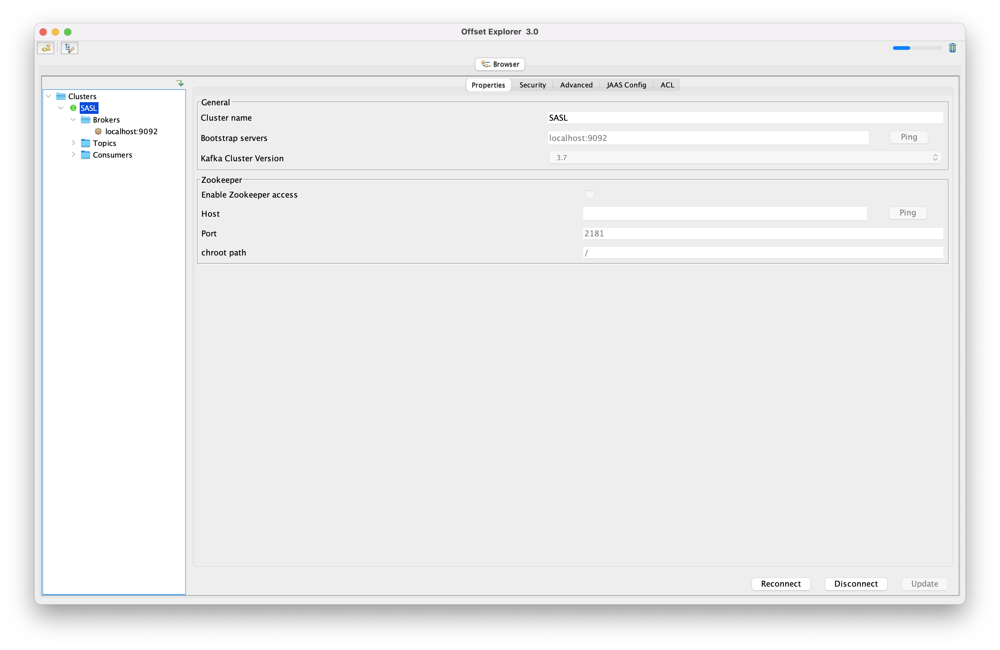
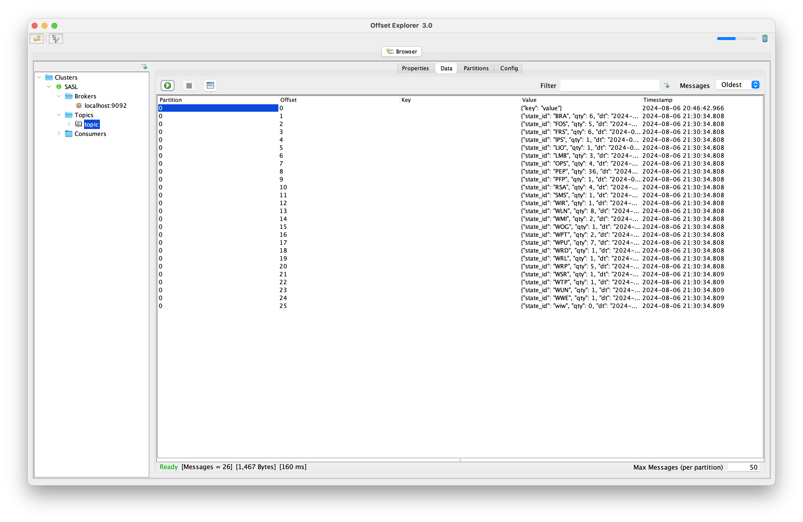

# kafka

## 1. docker-compose

```bash
$ docker compose up -d
$ docker compose ps

NAME        IMAGE                             COMMAND                  SERVICE     CREATED       STATUS         PORTS
kafka       confluentinc/cp-kafka:7.3.2       "/etc/confluent/dock…"   kafka       4 hours ago   Up 9 seconds   0.0.0.0:9092-9093->9092-9093/tcp
zookeeper   confluentinc/cp-zookeeper:7.3.2   "/etc/confluent/dock…"   zookeeper   4 hours ago   Up 9 seconds   2888/tcp, 0.0.0.0:2181->2181/tcp, 3888/tcp
```

## 2. offset explorer



## 3. topic creation

Создание топика происходит при записи в него первого сообщения

## 4. producer

```bash
(venv) $ python3 producer.py
```

## 5. Просмотр данных в топике




## 6. consumer

```bash
(venv) $ python3 consumer.py
1: {'state_id': 'BRA', 'qty': 6, 'dt': '2024-08-06 08:18:04'}
2: {'state_id': 'FOS', 'qty': 5, 'dt': '2024-08-06 08:18:04'}
3: {'state_id': 'FRS', 'qty': 6, 'dt': '2024-08-06 08:18:04'}
...
```