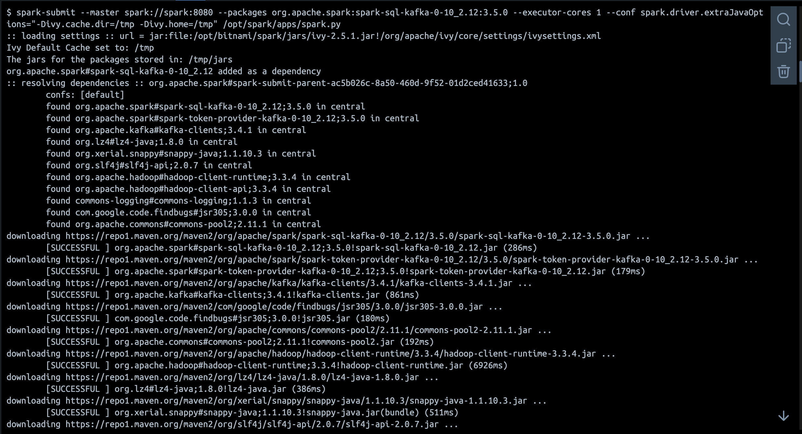

## #5

### Данные в кафке


### Данные в клике до запуска


### Запуск спарка + в UI

```bash
pip install clickhouse_driver pandas
spark-submit --master spark://spark:8080 --packages org.apache.spark:spark-sql-kafka-0-10_2.12:3.5.0 --executor-cores 1 --conf spark.driver.extraJavaOptions="-Divy.cache.dir=/tmp -Divy.home=/tmp" /opt/spark/apps/spark.py
```




### Данные в клике после запуска


