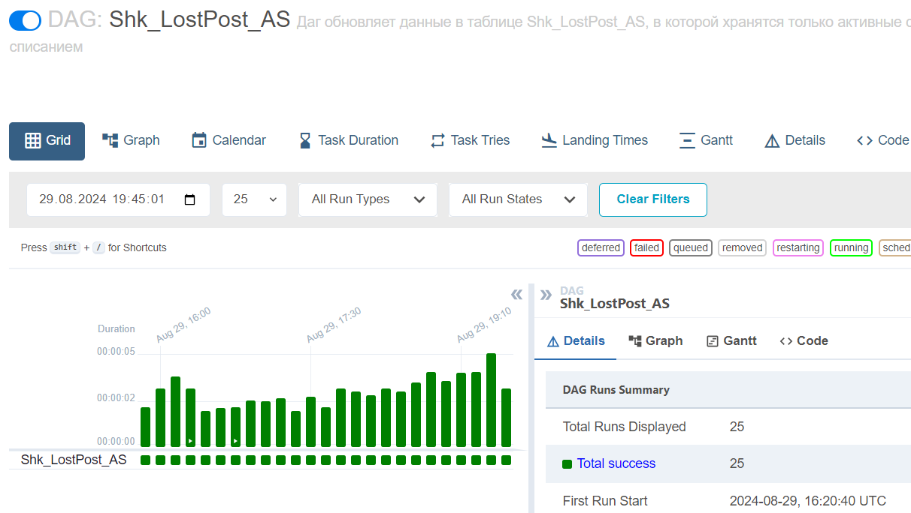
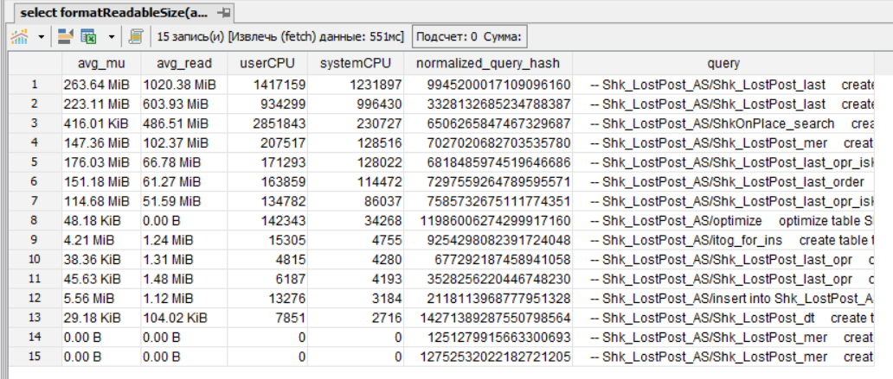

## #Финальный проект

#### Описание проблемы

Команда списаний планирует использовать инструмент Jasper. Он позволяет автоматически создавать отчеты и отправлять пользователям. Но существуют сложности работы с Clickhouse. К примеру, невозможно использовать функции (как в PostgreSQL), чтобы обернуть все расчеты в один блок. В данном случае приходится создавать datamart. 

#### Решение проблемы
Предлагается создать витрину данных, которая будет постоянно обновляться и содержать актуальные данные, которые требуются пользователям, а Jasper будет их предоставлять.
Для этого были созданы витрина Shk_LostPost_AS, которая содержит только активные списания (без дублей, без оприходований), DAG и проведена первичная подготовка данных 

#### Подготовка таблицы
Были проведены несколько запросов, которые сделали первичную обработку таблицы. 
- исключены все оприходования
- залиты историчные данные
- таблица отсортирована по ключу (shk_id)

#### Создание DAG
Даг отрабатывает в режиме @continuous. Первым делом при запуске вычисляется максимальная дата предыдущей заливки, затем запросом достаем новые записи.
Данная схема реализована через Materialized View Shk_LostPost_not_parsed, в которой отслеживается время заливки и подбираются требуемые данные для работы.
Далее работаем с оприходованием и исключаем из новых данных.
Затем сортировка, подготовка данных и заливка.
После всех работ назначаем optimize, чтобы не ждать события и удалить дубли сразу, так как используется движок ReplacingMergeTree.

#### Как было
Реализовать связку Clickhouse и Jasper для вывода нужных данных было невозможно
#### Как стало 
Теперь с помощью одного запроса к витрине Shk_LostPost_AS возможно вычислить только активные списания и сразу начать с ними работать
Пример для работы:
~~~~sql
select *
from Shk_LostPost_AS
where 1
   and case when $P{dt_operation_min} is not null then  dt_operation >= $P{dt_operation_min} else true end
   and case when $P{dt_operation} is not null then  dt_operation < $P{dt_operation} else true end
   and case when $P{shk} is not null then  shk_id = $P{shk} else true end
   and case when $P{lostreason_id} is not null then  lostreason_id = $P{lostreason_id} else true end
~~~~
#### Итог
Тем самым, была организована удобная среда для работы со списаниями, различными инструментами, это поможет как для обычных выгрузок, но и для системы автоматических отчетов Jasper

#### Нагрузка по ресурсам

#### МР на DDL
https://wh-hard01.kol.wb.ru/wh_reports/db_schema/main/-/merge_requests/671